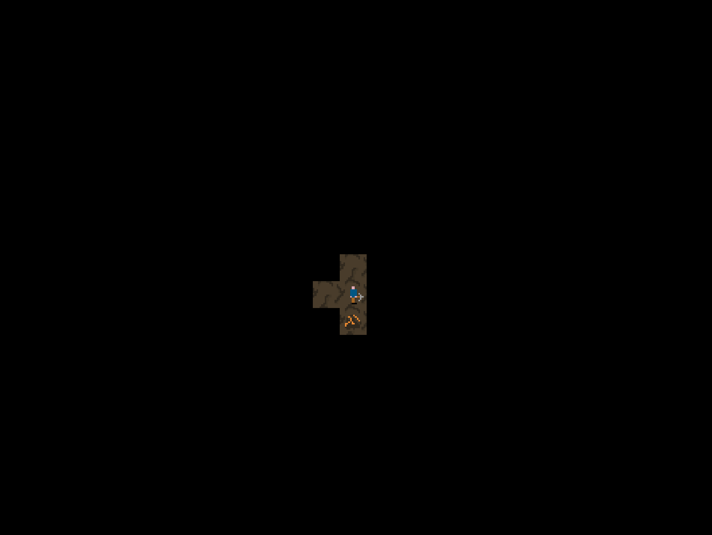

NOTE: please fill in the first section with information about your game.

# Cave Miner

Cave Miner is Sihan Wang's implementation of [Cave Explorer](http://graphics.cs.cmu.edu/courses/15-466-f17/game1-designs/aluo/) for game1 in 15-466-f17.




## Asset Pipeline

A single sprite atlas is used. It contains the sprites for two types of base tiles and two sprites for the player character. In addition it contains to pre written phrases which can be directly extracted and rendered. Asset loading is done by rendering specific portions of the png file, which is the format of the sprite atlas. Sprite information were manually loaded due to simplicity in this particular case as there were only a total of 6 distinct sprites.

## Architecture

The logical structure is a two dimensional array where each element is a logical representation of a floor tile. The tile contains information regarding whether it is a valid location to travel to, whether it has a rock, whether it has treasure, and whether it can be deleted. The first three attributes are fairly self evident. The fourth attribute is used due the way a board is generated. First a complete board where all locations are traversable is formed, then starting with a random tile, we start deleting. Note that all tiles starts with a true value in can be deleted. When a tile is deleted the 8 surrounding tiles, assuming they exist are marked as not deletable to guarantee that all locations are reachable. Then this deletion process parses through the entire board, where there is a chance a tile will be made not traversable if it is deletable. Similarly, rocks are randomly scattered on the board with each tile having the same randomized chance of having a rock. The treausre location is randomly generated and is guaranteed to have a rock and also guaranteed to not be at the starting location. The Update function along with event polling takes care of character position. The character position is then used in the draw step to only render the current and 4 adjacent tiles. But if the adjacent tile is not traversable, it is also not rendered.

## Reflection

I think I am quite satisfied with the outcome, if I had more time, I would likely have added levels since I have a genBoard function implemented. At first I tried to use sprites that already overlaid the character on the floor tilesets, but turns out that would cause the board logic to require more variables so I went back to the normal way. Generally I think the process was fine, did have to stay up until about 4 in the morning to finish it but it only really took me about 6-8 hours so it was not that bad.

The design document was quite clear, but I wanted to make some minor changes, so I emailed the professor.


# About Base1

This game is based on Base1, starter code for game1 in the 15-466-f17 course. It was developed by Jim McCann, and is released into the public domain.

## Requirements

 - modern C++ compiler
 - glm
 - libSDL2
 - libpng

On Linux or OSX these requirements should be available from your package manager without too much hassle.

## Building

This code has been set up to be built with [FT jam](https://www.freetype.org/jam/).

### Getting Jam

For more information on Jam, see the [Jam Documentation](https://www.perforce.com/documentation/jam-documentation) page at Perforce, which includes both reference documentation and a getting started guide.

On unixish OSs, Jam is available from your package manager:
```
	brew install ftjam #on OSX
	apt get ftjam #on Debian-ish Linux
```

On Windows, you can get a binary [from sourceforge](https://sourceforge.net/projects/freetype/files/ftjam/2.5.2/ftjam-2.5.2-win32.zip/download),
and put it somewhere in your `%PATH%`.
(Possibly: also set the `JAM_TOOLSET` variable to `VISUALC`.)

### Bulding
Open a terminal (on windows, a Visual Studio Command Prompt), change to this directory, and type:
```
	jam
```

### Building (local libs)

Depending on your OSX, clone 
[kit-libs-linux](https://github.com/ixchow/kit-libs-linux),
[kit-libs-osx](https://github.com/ixchow/kit-libs-osx),
or [kit-libs-win](https://github.com/ixchow/kit-libs-win)
as a subdirectory of the current directory.

The Jamfile sets up library and header search paths such that local libraries will be preferred over system libraries.
